# Open-AIOps

**炎龙智能 Agentic AIOps**

**V4.0.1 正式发布**：AI 智能体核心引擎全面升级，任务规划、执行与结果收敛同步优化。同等运维任务下响应更快、判断更准，Token 消耗更低，复杂对话的使用成本明显下降。任务规划模式完成 100 次 Chat 实测，任务完成率 100%，规划链路稳定可复现。

大模型驱动的多智能体协同运维平台，覆盖开发、运维与配置。把对话运维、巡检、根因分析、容量预测、告警处置和资产台账串成一条线。

[官网](https://www.yanlong-ai.com) · [立即体验](https://aiops.yanlong-ai.com) · [申请免费部署](https://www.yanlong-ai.com)

## 产品界面

**AI 天穹首页** — 值班总览、快捷入口、告警与待办

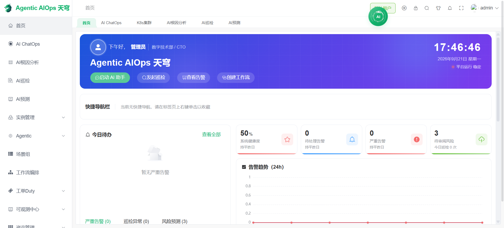

**AI ChatOps** — 选中主机后用自然语言排查。下面是一次「查 CPU 最高进程，并看它开放了哪些端口」的对话：先拆成任务，再给出进程、端口和结论。

**拆任务** — 问题拆成查高占用进程、查该进程端口、汇总结论

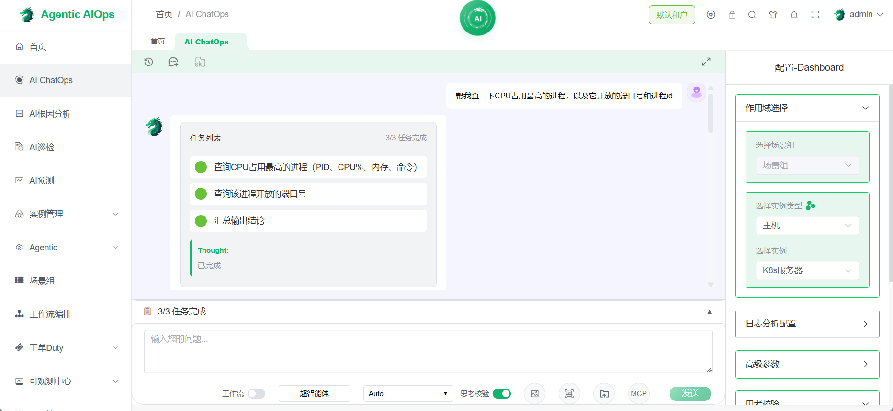

**查进程** — 列出持续占用最高的进程：进程名、PID、CPU、内存、运行用户和启动时间，并标出瞬时冲高、已经退出的进程

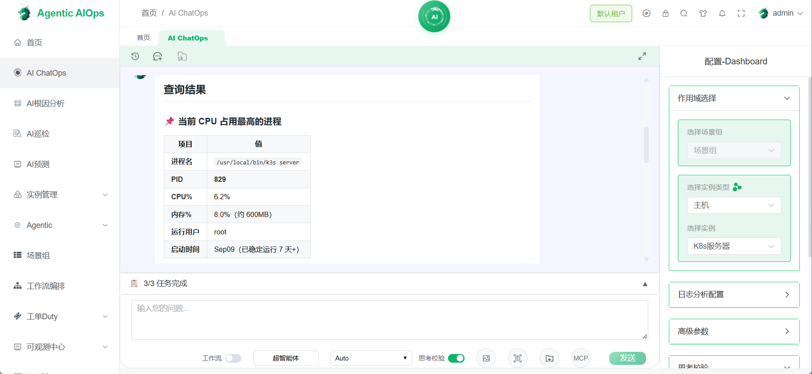

**查端口** — 按该进程列出监听端口、协议、监听地址和用途

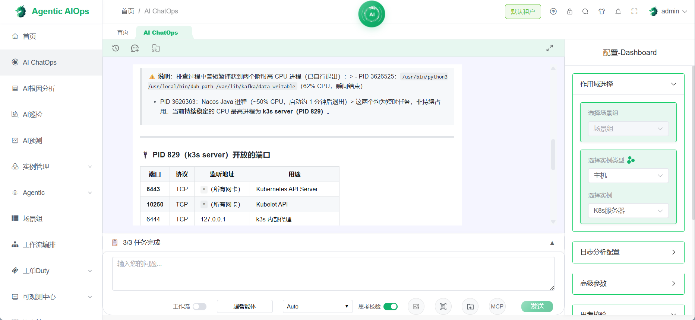

**给结论** — 区分对外暴露和仅本机访问的端口，方便判断是否需要继续处理

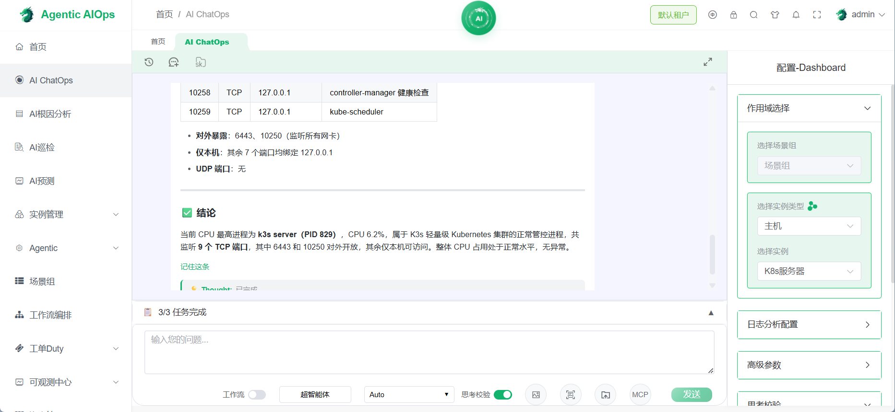

**AI 根因分析** — 告警归组、分析状态、一键分配与追问

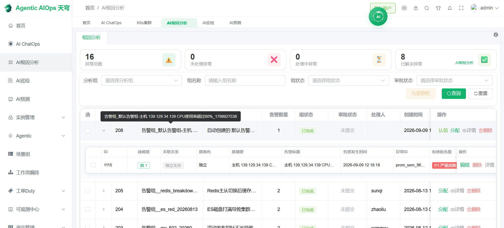

**AI 巡检报告** — 只读巡检、命令可核验、导出报告

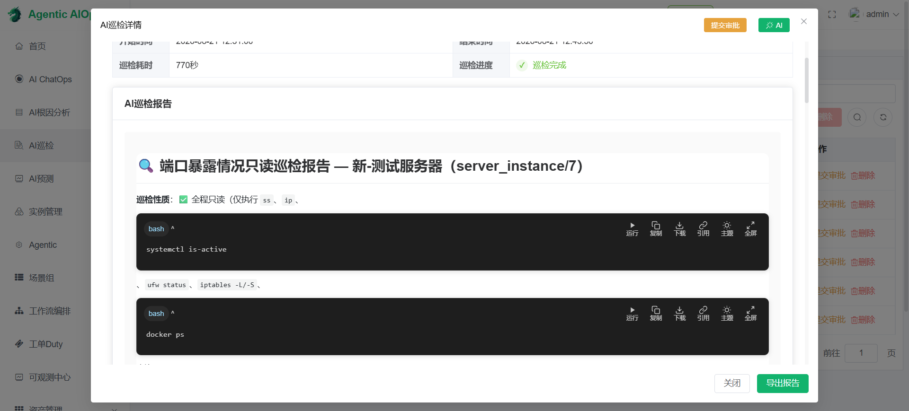

**AI 预测** — 趋势曲线、打满预警、风险详情

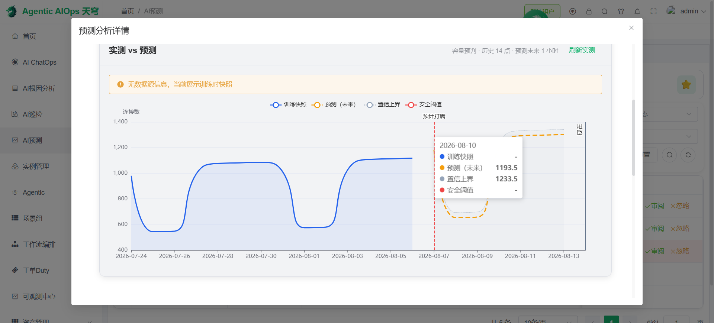

**智能体配置** — 内置 / 自定义智能体、组件专家编排

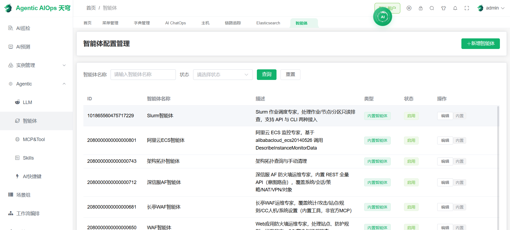

**组件纳管** — 数据库、中间件与可观测组件的查询和分析

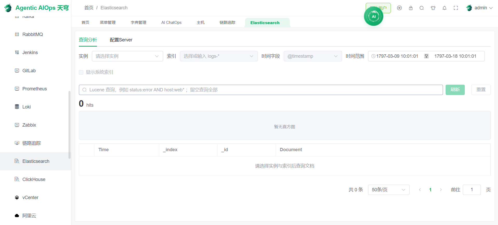

**工单 Duty** — 审核、执行、驳回全流程闭环

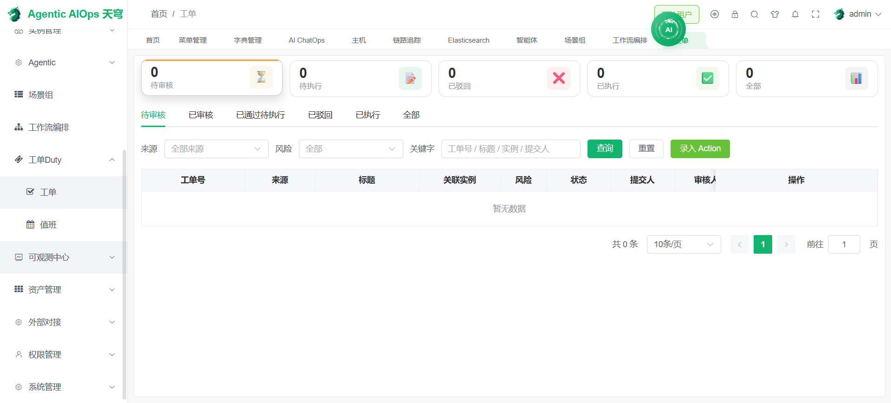

**工作流 / Chatflow** — 可视化编排、发布为对话应用

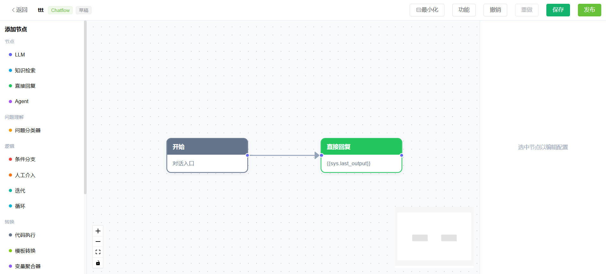

**主机纳管** — 添加 Linux / 网络 / 虚拟化等主机，绑定智能体

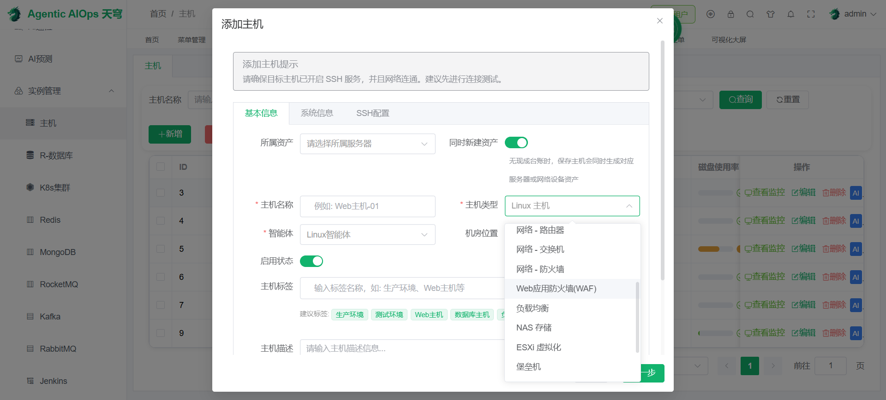

---

## 解决什么问题

监控工具有了，值班还是靠人。告警归组、巡检、容量判断和处置留痕，仍然卡在经验和班次上。

| 传统痛点 | 平台能力 |
|---------|---------|
| 巡检靠人，漏检是常态 | **AI 巡检**，定时或手动出报告 |
| 告警堆在一起，根因靠经验 | **AI 根因分析**，归组后可继续追问 |
| 容量问题总是事后才发现 | **AI 预测**，看趋势和风险等级 |
| 处置没有留痕 | **工单 Duty**，审核、执行、驳回可追溯 |

完整能力与案例见官网：[www.yanlong-ai.com](https://www.yanlong-ai.com)

---

## V4.0.1 说明

### 产品优势

高效算法支撑下的全方位智能运维：看得更全，排得更快，接得更省事，安全留在平台内。

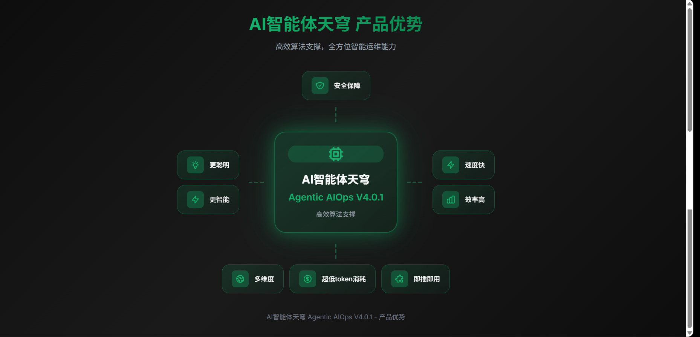

| 优势 | 含义 |
|------|------|
| **更聪明 / 更智能** | 跨组件关联告警、日志、配置和资产，结论可以继续追问 |
| **速度快 / 效率高** | 值班、巡检、根因和工单在同一平台完成 |
| **多维度** | 指标、日志、配置、拓扑和工单放在一起看 |
| **超低 token 消耗** | 同样的排障和巡检，控制模型调用开销 |
| **即插即用** | 预置连接器，配好即可接入已有监控和业务系统 |
| **安全保障** | 高风险操作可校验、可询问、可拦截，过程可审计 |

### 组件支持范围

V4 的组件支持能力矩阵。控制台里已经开放录入的实例，见下方「实例纳管」。

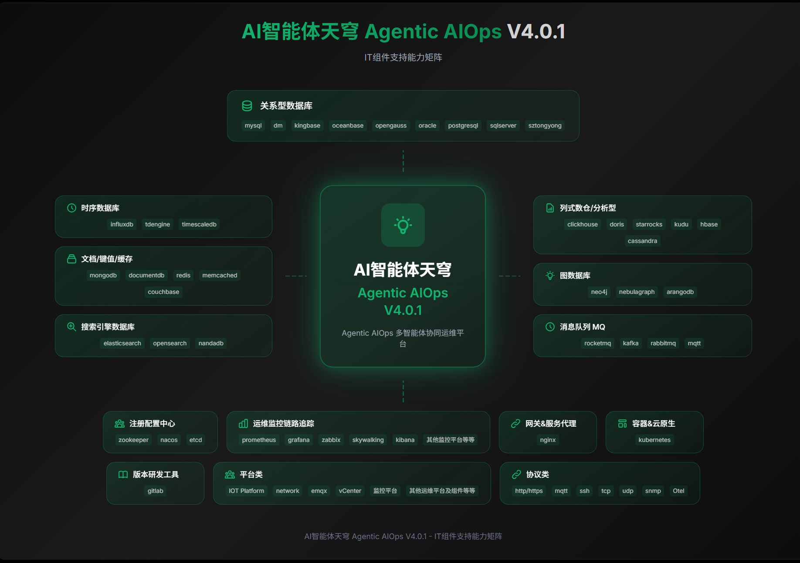

| 类别 | 组件 |
|------|------|
| **关系型 / 国产库** | MySQL、PostgreSQL、Oracle、SQL Server、达梦、openGauss、人大金仓、OceanBase、神州通用 |
| **时序 / 分析 / 图** | InfluxDB、TDengine、TimescaleDB、ClickHouse、Doris、StarRocks、Kudu、HBase、Cassandra、Neo4j、NebulaGraph、ArangoDB |
| **文档 / 缓存 / 搜索** | MongoDB、DocumentDB、Redis、Memcached、Couchbase、Elasticsearch、OpenSearch |
| **消息 / 注册 / 网关** | Kafka、RabbitMQ、RocketMQ、MQTT、ZooKeeper、Nacos、etcd、Nginx |
| **可观测 / 云原生** | Prometheus、Grafana、Zabbix、SkyWalking、Kibana、Kubernetes |
| **平台与协议** | GitLab、网络设备、EMQX、vCenter、监控与运维平台；HTTP/HTTPS、SSH、TCP、UDP、SNMP、OpenTelemetry |

### 智能体组成

智能体是对话、巡检和处置的入口，外围能力按场景组合。

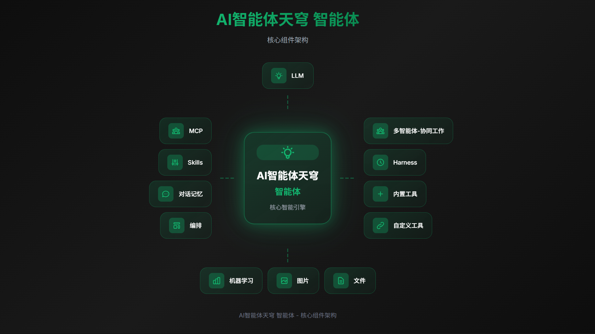

- **模型与协同**：接入 LLM，多个智能体分工协作
- **扩展**：MCP、Skills、内置工具和自定义工具
- **上下文**：保留对话记忆，支持编排，可处理指标、图片和文件
- **运行**：由平台调度执行，高风险步骤仍走确认和工单

### 核心能力

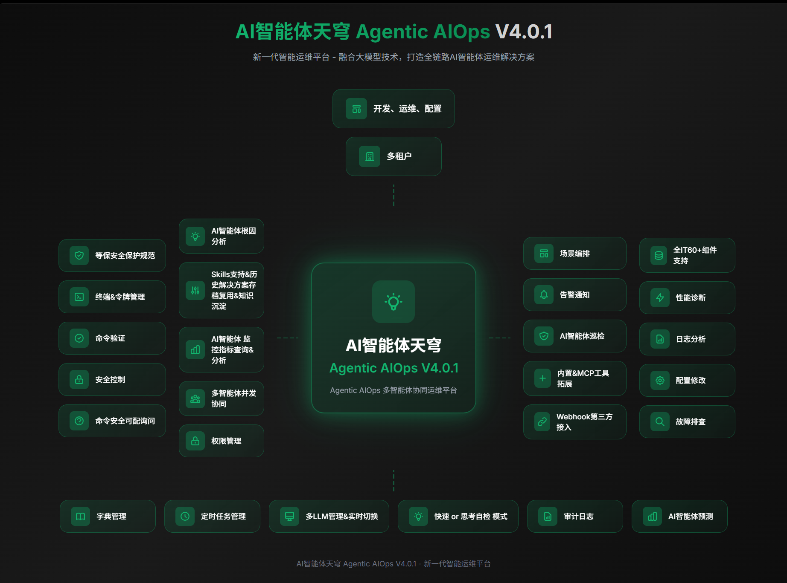

- **一体平台**：开发、运维、配置在同一套系统里完成，支持多租户
- **分析处置**：根因分析、指标查询、巡检、日志分析、性能诊断、故障排查、配置修改、容量预测
- **智能体**：Skills 与历史方案沉淀、多智能体协同、内置工具与 MCP、场景编排、多模型切换、快速或自检模式
- **安全治理**：等保相关控制、终端与令牌、命令校验与询问、权限、审计、告警通知、Webhook 第三方接入
- **系统管理**：字典、定时任务、审计日志

### 等保 2.0

对照等保 2.0 技术要求组织安全能力：身份鉴别、访问控制、安全审计、入侵防范、恶意代码防范、数据保密与剩余信息保护。智能体侧约束越权访问，操作留痕，高风险动作需人工确认。

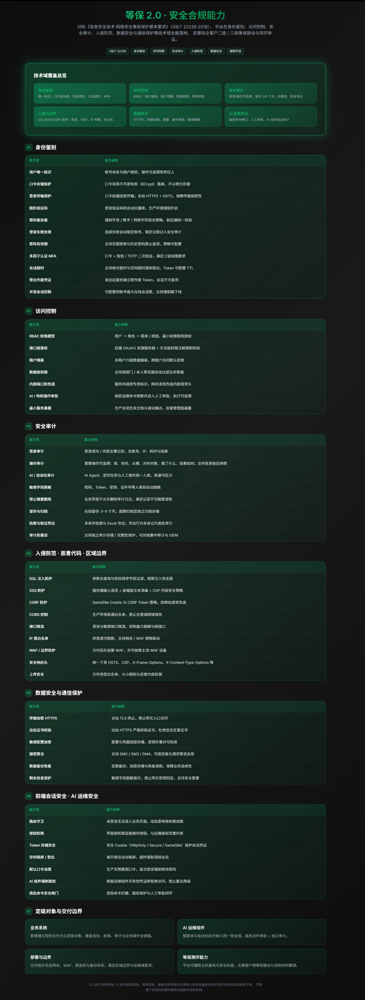

---

## 产品能力

下面是当前对外提供的能力。

### 智能运维

- **AI ChatOps**：用自然语言查状态、做诊断，按场景组或具体实例限定范围；高风险处置进入工单审核
- **AI 根因分析**：告警归组、查看分析结论与告警详情，分析后可以继续追问
- **AI 巡检**：按实例定时或手动巡检，查看待执行 / 执行中 / 成功 / 失败，导出可读报告
- **AI 预测**：按风险大类和等级查看容量与资源风险，打开趋势和风险详情

### 实例纳管

在「实例管理」中登记并查询这些对象，对话和巡检都基于已纳管实例：

| 类别 | 组件 |
|------|-----------|
| **主机** | Linux、Windows，以及交换机 / 路由器 / 防火墙等网络设备 |
| **关系型与国产库** | MySQL、PostgreSQL、Oracle、SQL Server、DB2、达梦、openGauss、人大金仓、OceanBase、神州通用、南大通用 |
| **缓存 / 文档 / 分析** | Redis、MongoDB、Elasticsearch、ClickHouse |
| **消息 / 注册** | Kafka、RabbitMQ、RocketMQ、Nacos |
| **云与虚拟化** | Kubernetes 集群、vCenter、阿里云 ECS |
| **可观测** | Prometheus、Loki、Zabbix、链路追踪（SkyWalking） |
| **交付** | Jenkins、GitLab、Slurm |

### 智能体与编排

- **LLM**：接入云端或私有化模型
- **智能体**：内置与自定义智能体、按组件编排
- **MCP 与工具、AI 快捷键**：扩展对话能调用的能力，把常用问法收成快捷入口
- **Skills**：把一类运维场景收成可复用技能。本仓库 [`skills/`](skills/) 收录 8 个技能，上传后即可在对话和巡检里选用

| Skill | 能做什么 |
|------|----------|
| **Linux 服务器巡检** | 只读检查负载、CPU、内存、磁盘、失败服务、高占用进程和容器状态，并生成报告 |
| **MySQL 全维度巡检** | 检查实例健康、连接、慢查询、主从复制和账号安全，可结合近期趋势出报告 |
| **网络设备巡检** | 对华为、H3C、思科等交换机 / 路由器 / 防火墙做只读巡检，覆盖版本、资源、接口、电源风扇和活跃告警 |
| **K8s 负载检测与处理** | 找出高负载节点和占用高的 Pod，确认后再做迁移，并留下报告 |
| **等保 2.0 技术测评** | 对已授权的 Linux 主机做基线、端口边界、通信加密和漏洞核查，汇总测评结果 |
| **Redis 内存打满** | 先排查大 Key 和过期策略，再给出清理或扩容方案；改动需确认后执行 |
| **告警风暴降噪** | 把短时间刷屏的同类告警归拢，临时压住噪声，真实故障再进入根因分析 |
| **端口暴露加固** | 先核对主机对外端口，确认后把放行范围收敛到管理与业务所需端口 |

- **场景组**：把一组实例收成一个运维场景，对话时一次选中
- **工作流编排**：把常用场景画成流程，发布为对话应用

### 告警与值班

- **可视化大屏**：值班一眼看到运行态势
- **告警规则**：按来源、指标和覆盖范围配置条件，支持静默
- **告警通知**：飞书、钉钉、企业微信、邮件、短信，并保留发送记录
- **监控源配置**：接入已有监控数据
- **工单**：待审核、已通过待执行、已驳回、已执行
- **值班**：排班与交接

### 资产

- **资产总览**：按类型、部门和生命周期看数量，提示即将到期的维保
- **资产台账**：服务器、网络设备、终端、办公外设、云资产、系统软件、应用软件、机房机柜、UPS、精密空调
- **生命周期**：采购入库、领用 / 退还、维修 / 维保、报废处置
- **CMDB**：架构拓扑，查看和补齐资产之间的关系
- **盘点审计**、**资产统计**、**维保成本**

### 对接与权限

- **应用管理**、**推送第三方**：把告警和事件交给外部系统
- **组织权限**：租户、用户、角色、部门、岗位
- **审计与系统**：操作日志、文件、字典、参数、定时任务、令牌
- **私有化交付**：数据留在企业内，支持等保场景与离线授权。部署边界和接入方式见下文「部署方式」「集成对接」

多模型可切换（DeepSeek、Qwen、GPT、Kimi 等），云端 API 与私有化推理均可。

完整介绍见官网：[www.yanlong-ai.com](https://www.yanlong-ai.com)

---

## 适用场景

覆盖数据中心、中间件和云原生环境。研发看日志和变更，运维做巡检、告警和排障。

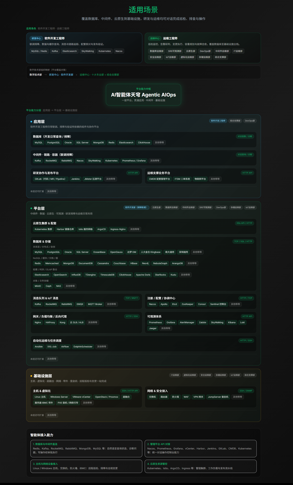

- **研发**：日志与错误码、数据库与缓存、消息队列、容器与发布
- **运维**：巡检、告警收敛、容量、变更和故障定位
- **应用层**：业务系统依赖的数据库、中间件、容器和可观测组件
- **平台层**：Kubernetes、监控大盘、日志与链路、运维平台
- **基础设施**：Linux / Windows 主机、网络与安全设备、虚拟化与机房
- **交付**：7×24 值班、等保核查、在已有监控上增加对话和根因分析、多客户交付

---

## 部署方式

平台和推理都放在企业内网。计算、日志、配置和业务数据不出边界，不上传公有云，也不用于外部模型训练。

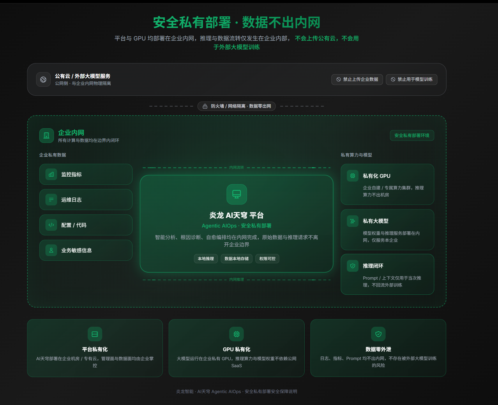

- **平台私有化**：安装在企业机房或专有云，管理和数据由企业掌握
- **算力私有化**：使用企业自有或专属 GPU，推理留在内网
- **数据零外泄**：指标、日志、配置和当次对话只用于当场分析，不回流到外部训练

公有云或外部大模型若需使用，与企业内网隔离，默认不传出企业数据。

---

## 集成对接

可以整套独立部署，也可以把 AI 助手嵌进现有门户、ITSM 或管控台。

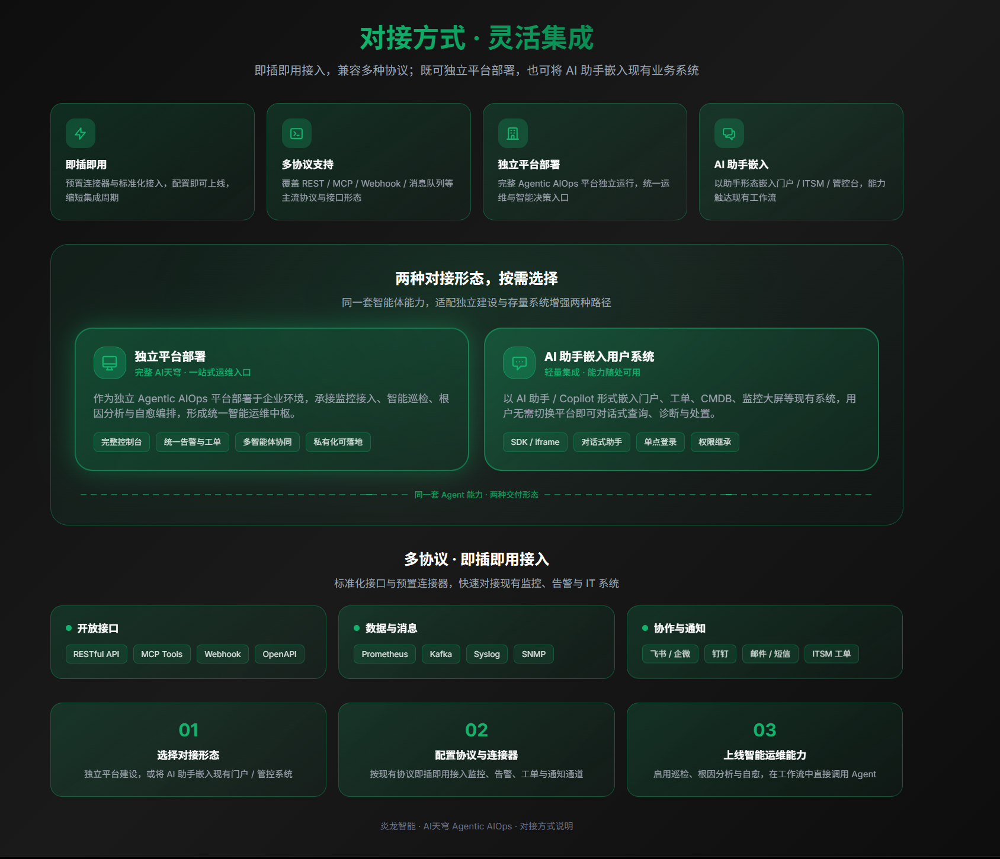

**两种形态**

- **独立平台**：作为统一运维入口，承接监控接入、巡检、根因分析和编排
- **嵌入现有系统**：以助手形式进门户、工单、CMDB 或监控大屏，沿用原有登录和权限

**接入方式**

| 类别 | 方式 |
|------|------|
| **开放接口** | REST API、MCP、Webhook、OpenAPI |
| **数据与消息** | Prometheus、Kafka、Syslog、SNMP |
| **通知与协作** | 飞书、企业微信、钉钉、邮件、短信、ITSM 工单 |

接入按三步走：选择独立部署或嵌入，配好协议和连接器，再在工作流里启用巡检、根因分析和受控处置。

---

## 如何体验

1. **在线试用**：[https://aiops.yanlong-ai.com](https://aiops.yanlong-ai.com)
2. **申请免费部署**：[https://www.yanlong-ai.com](https://www.yanlong-ai.com) 提交表单，或扫码加微信
3. **资源评估**：官网「资源评估」页，按规模给出部署建议

标准环境通常约 1 周完成部署；复杂环境定制集成约 2 周。

---

## 联系我们（微信最快）

  
   
  扫码添加售前微信

- 扫上方二维码添加 **售前** 销售经理微信
- 官网首页「申请免费部署」在线提交
- 电话：0532-83868627
- 地址：中国（山东）自由贸易试验区青岛片区前湾保税港区鹏湾路 45 号东办公楼一楼 102 室

---

## 版权

© 2025–2026 炎龙智能（Yanlong AI）· [www.yanlong-ai.com](https://www.yanlong-ai.com)

本仓库仅作产品介绍与体验入口。**炎龙智能 Agentic AIOps** 平台版权归炎龙智能所有，须经授权使用。

炎龙智能、Agentic AIOps、AI 天穹等为炎龙智能相关品牌或产品名称。
